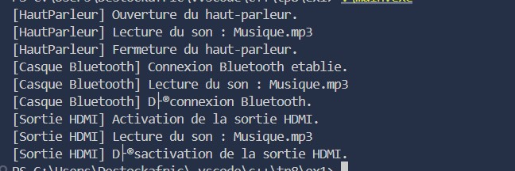
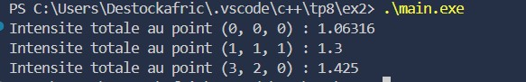
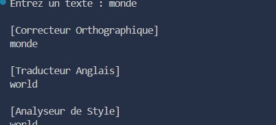

###  Exercice 1 – Gestion de périphériques audio

####  Description
Cet exercice illustre l’utilisation du polymorphisme en C++ à travers une hiérarchie de périphériques audio.  
Chaque périphérique (haut-parleur, casque Bluetooth, sortie HDMI) implémente différemment les opérations de base : **ouvrir**, **jouer un son**, et **fermer**.

####  Fonctionnalités
- Classe abstraite `SortieAudio` avec des méthodes virtuelles pures.
- Trois implémentations concrètes : `HautParleur`, `CasqueBT`, `SortieHDMI`.
- Fonction polymorphe `tester(SortieAudio*)` exécutant les actions de chaque périphérique.
- Destructeur virtuel pour une gestion correcte de la mémoire.

####  Code Structure
- `SortieAudio.h` : définition des classes et méthodes virtuelles.
- `SortieAudio.cpp` : implémentations spécifiques.
- `main.cpp` : création d’un tableau de pointeurs vers `SortieAudio` et test dynamique.

####  Résultat
Chaque périphérique affiche sa séquence d’ouverture, de lecture et de fermeture.  
Capture d’écran :  

---

###  Exercice 2 – Moteur de rendu 3D

####  Description
Cet exercice met en œuvre un système de lumières polymorphes dans un moteur 3D.  
Chaque type de lumière (directionnelle, ponctuelle, spot) calcule différemment l’intensité au point d’éclairage.

####  Fonctionnalités
- Classe abstraite `Lumiere` avec méthode virtuelle pure `intensite(const Vec3&)`.
- Classes dérivées :
  - `LumiereDirectionnelle`
  - `LumierePonctuelle`
  - `LumiereSpot`
- Utilisation de `std::unique_ptr` et `std::vector` pour une gestion mémoire moderne.
- Fonction `calculerEclairage()` qui additionne les intensités de toutes les sources.

####  Code Structure
- `Lumiere.h` : définition de la structure `Vec3` et de la classe abstraite `Lumiere`.
- `Lumiere.cpp` : implémentations spécifiques de chaque lumière.
- `main.cpp` : création de plusieurs sources lumineuses et calcul des intensités.

####  Résultat
Affichage des intensités cumulées de plusieurs lumières sur différents points de la scène.  
Capture d’écran :  

---

###  Exercice 3 – Système de plugins de traitement de texte

####  Description
Cet exercice illustre un **système extensible de plugins** appliqués à un éditeur de texte.  
Chaque plugin modifie le texte à sa manière : correction, traduction ou analyse stylistique.

####  Fonctionnalités
- Classe abstraite `Plugin` avec :
  - `nom()` : retourne le nom du plugin.
  - `traiter()` : transforme le texte.
- Trois plugins :
  - `CorrecteurOrthographique`
  - `TraducteurAnglais`
  - `AnalyseurStyle`
- Factory interne (`creerPlugin()`) pour instancier dynamiquement le bon plugin.
- Utilisation de `std::unique_ptr` pour gérer les objets sans fuite mémoire.

####  Code Structure
- `Plugin.h` : définition de la classe abstraite et des trois plugins.
- `Plugin.cpp` : implémentation des traitements spécifiques.
- `main.cpp` : lecture d’un texte utilisateur et application successive des plugins.

####  Résultat
Le texte est corrigé, traduit, puis analysé successivement.  
Chaque transformation est affichée avec le nom du plugin appliqué.  
Capture d’écran :  

